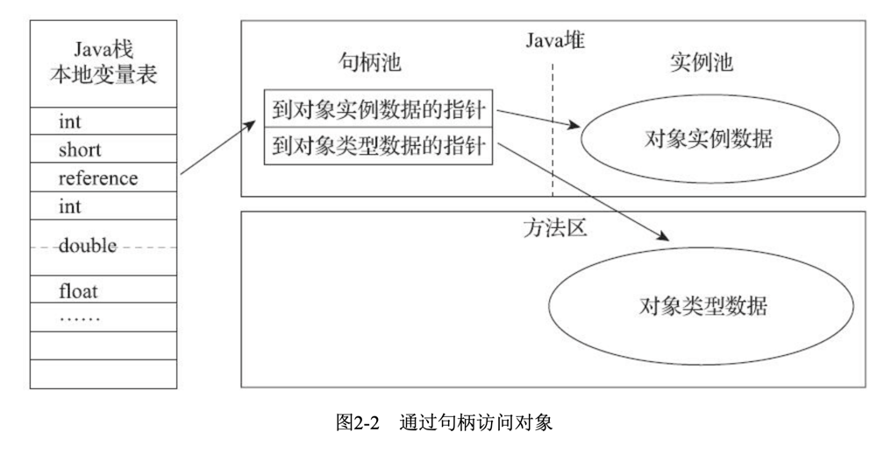

#jvm 运行时数据区（java内存模型）

## 程序计数器
程序计数器是一块较小的内存空间，可以看作是当前线程所执行的字节码的行号指示器。在虚拟机的概念模型中，字节码解释器工作时就是通过改变这个计数器的值来选取下一条需要执行的字节码指令。分支、循环、跳转、异常处理、线程恢复等基础功能都需要依赖这个计数器来完成。如果线程正在执行的是一个Java方法，这个计数器记录的是**正在执行的虚拟机字节码指令的地址**；如果正在执行的是Native方法，这个计数器的值则为空（Undefined）。
## Java虚拟机栈
虚拟机栈描述的是**Java方法执行的内存模型**：每个方法在执行的同时都会创建一个**栈帧用于存储局部变量表、操作数栈、动态链接、方法出口等信息**。每一个方法从调用直至执行完成的过程，就对应着一个栈帧在虚拟机中入栈到出栈的过程。
## 本地方法栈
本地方法栈与虚拟机栈所发挥的作用是非常相似的，其区别不过是虚拟机栈为虚拟机执行Java方法（字节码）服务，而本地方法栈则为虚拟机使用到的Native方法服务。
## Java堆
Java堆是被**所有线程共享的一块内存区域**，在虚拟机启动时创建。此内存区域的唯一目的就是存放对象实例，几乎所有的对象实例都在这里分配内存。Java堆是垃圾收集器管理的主要区域，因此很多时候也被称作“GC堆”。
## 方法区
方法区与Java堆一样，是各个线程共享的内存区域，用于**存储已被虚拟机加载的类信息、常量、静态变量、即时编译器编译后的代码等数据**。在HotSpot虚拟机中，方法区与Java堆一样，也是各个线程共享的内存区域，用于存储已被虚拟机加载的类信息、常量、静态变量、即时编译器编译后的代码等数据。在HotSpot虚拟机中，方法区与Java堆一样，也是各个线程共享的内存区域，用于存储已被虚拟机加载的类信息、常量、静态变量、即时编译器编译后的代码等数据。
## 运行时常量池
运行时常量池是方法区的一部分。**Class文件中除了有类的版本、字段、方法、接口等描述信息外，还有一项信息是常量池，用于存放编译期生成的各种字面量和符号引用，这部分内容将在类加载后进入方法区的运行时常量池中存放**。运行时常量池相对于Class文件常量池的另外一个重要特征是具备动态性，Java语言并不要求常量一定只有编译期才能产生，也就是并非预置入Class文件中常量池的内容才能进入方法区运行时常量池，运行期间也可能将新的常量放入池中，这种特性被开发人员利用得最多的便是String类的intern()方法。
## 直接内存
直接内存并不是虚拟机运行时数据区的一部分，也不是Java虚拟机规范中定义的内存区域。但是这部分内存也被频繁地使用，而且也可能导致OutOfMemoryError异常出现。在NIO中引入了一种基于通道（Channel）与缓冲区（Buffer）的I/O方式，它可以使用Native函数库直接分配堆外内存，然后通过一个存储在Java堆里面的DirectByteBuffer对象作为这块内存的引用进行操作。这样能在一些场景中显著提高性能，因为避免了在Java堆和Native堆中来回复制数据。
##hotspot虚拟机对象探秘
###java对象的创建
对象的创建过程可以分为以下三个步骤：
1. 在堆上分配内存
2. 初始化对象
3. 设置对象指针指向刚分配的内存
####java对象创建的详细过程
1. 虚拟机遇到一条new指令时，首先将去检查这个指令的参数是否能在常量池中定位到一个类的符号引用，并且检查这个符号引用代表的类是否已经被加载、解析和初始化过。如果没有，那必须先执行相应的**类加载过程**。
2. 虚拟机为新生对象分配内存。对象所需的内存大小在类加载完成后便可完全确定。分配方式有两种：指针碰撞和空闲列表。指针碰撞是一种**紧凑型**的内存分配方式，它把内存按照使用与未使用的划分为两部分，指针碰撞就是在已使用的内存和未使用的内存之间设置一个指针作为分界点的一种方式。空闲列表是一种**非紧凑型**的内存分配方式，它把内存空间按照使用与未使用的划分为多个不连续的区域，每个区域都有一个列表来记录哪些内存块是可用的，哪些内存块已经被使用了。
   Serial、ParNew、Parallel Scavenge这三款收集器使用的都是指针碰撞的方式，而CMS收集器使用的是空闲列表的方式。G1收集器则是综合了两种方式的优点，它在内存空间中维护了多个**空闲列表**，每个列表中包含多个连续的空闲内存块，而且这些列表之间还有一个**全局的空闲列表**，用于记录那些不属于任何一个列表的空闲内存块。这样做的好处是可以避免在分配大对象时，由于没有足够的连续内存而导致的内存分配失败。另外，G1收集器还会维护一个**预留列表**，用于记录那些已经被使用了但是还没有被回收的内存块，这样做的好处是可以避免在分配小对象时，由于没有足够的连续内存而导致的内存分配失败。     
   除如何划分可用空间之外，还有另外一个需要考虑的问题:对象创建在虚拟机中是非常频繁的行为，即使仅仅修改一个指针所指向的位置，也会带来不小的性能开销。因此，HotSpot虚拟机对于对象分配的实现采用了TLAB（Thread Local Allocation Buffer，线程本地分配缓冲）的方式，即为每个线程分配一块私有的缓冲区，线程在这个缓冲区上进行对象分配，分配完毕之后再将缓冲区中的数据刷入到Java堆中。这样做的好处是可以避免多线程之间的同步问题，同时也可以提高对象分配的效率。
3. 虚拟机将分配到的内存空间都初始化为零值。这一步保证了对象的实例字段在Java代码中可以不赋初始值就直接使用，程序员可以通过使用字段的默认初始化值规则来确定这些字段的初始值。
4. 虚拟机在对象头中存储一些必要的信息，比如对象的哈希码（HashCode）、GC分代年龄、锁状态标志、线程持有的锁、偏向线程 ID、偏向时间戳等等。这些信息都可以在对象的创建过程中完成。
5. 虚拟机执行<init>方法来完成对象的初始化工作，这个方法称为实例构造器（Instance Initializer），它是对象被使用之前必须要执行的初始化方法。在对象初始化完成之后，对象才算是真正被使用，这个过程称为实例化（Initialization）。
6. 虚拟机将对象的引用返回给引用的使用者。
###对象的内存布局
对象在内存中的布局可以分为三块区域：对象头、实例数据和对齐填充。
####对象头
对象头主要包括两部分信息：**Mark Word**和**类型指针**。其中，Mark Word用于存储对象自身的运行时数据，如哈希码（HashCode）、GC分代年龄、锁状态标志、线程持有的锁、偏向线程 ID、偏向时间戳等等。而类型指针则是指向对象的类元数据的指针，虚拟机通过这个指针来确定这个对象是哪个类的实例。
####实例数据
实例数据部分是对象真正存储的有效信息，也是在程序中所定义的各种类型的字段内容。
####对齐填充
对齐填充不是必然存在的，也没有特别的含义，它仅仅起着占位符的作用。
###对象的访问定位
对象的访问定位可以分为两种方式：句柄访问和直接指针访问。
####句柄访问
句柄访问是Java堆中划分出一块内存来作为句柄池，Reference中存储的就是对象的句柄地址，而句柄中包含了对象实例数据与类型数据各自的具体地址信息。

####直接指针访问
直接指针访问将对象的数据和类型数据都存储在Java堆中，Reference中存储的就是对象的地址，通过这个地址就可以直接找到对象的数据和类型数据。

####两者的优势和劣势
使用句柄访问的好处是Reference中存储的是稳定的句柄地址，而对象的地址是可以变化的，因此即使在垃圾收集过程中，只要句柄地址不变，就可以保证引用对象的正确性。而使用直接指针访问的好处是速度快，因为它没有间接寻址的过程，而且在垃圾收集过程中，只要对象的地址没有发生变化，那么引用对象的速度也不会受到任何影响。

# 内存溢出异常
## Java堆溢出
Java堆是被所有线程共享的一块内存区域，在虚拟机启动时创建。此内存区域的唯一目的就是存放对象实例，几乎所有的对象实例都在这里分配内存。Java堆是垃圾收集器管理的主要区域，因此很多时候也被称作“GC堆”。
###堆内存溢出的原因
Java堆内存的OutOfMemoryError异常是实际应用中最常见的内存溢出异常情况。出现Java堆内存 溢出时，异常堆栈信息“java.lang.OutOfMemoryError”会跟随进一步提示“Java heap space”。
要解决Java堆内存溢出的问题，首先要明确Java堆内存溢出的原因。Java堆内存溢出的原因主要有两种：一种是内存泄露，另外一种是内存溢出。
## 方法区和运行时常量池溢出
## 本机直接内存溢出

