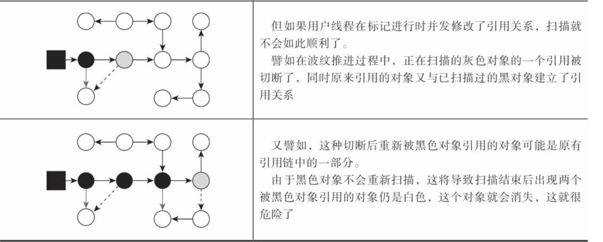
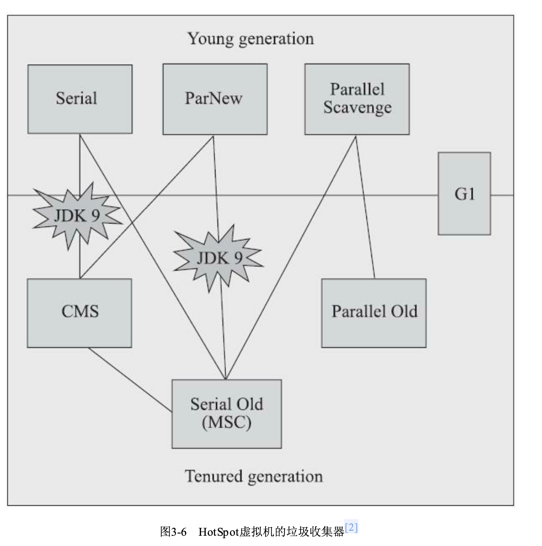
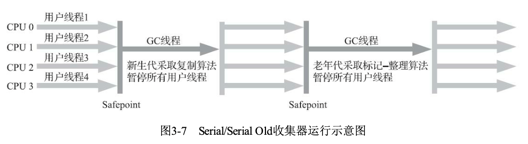
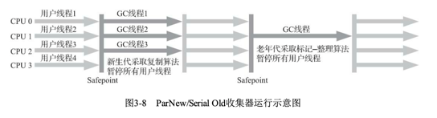
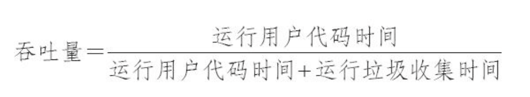
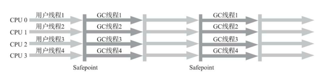
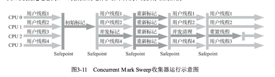
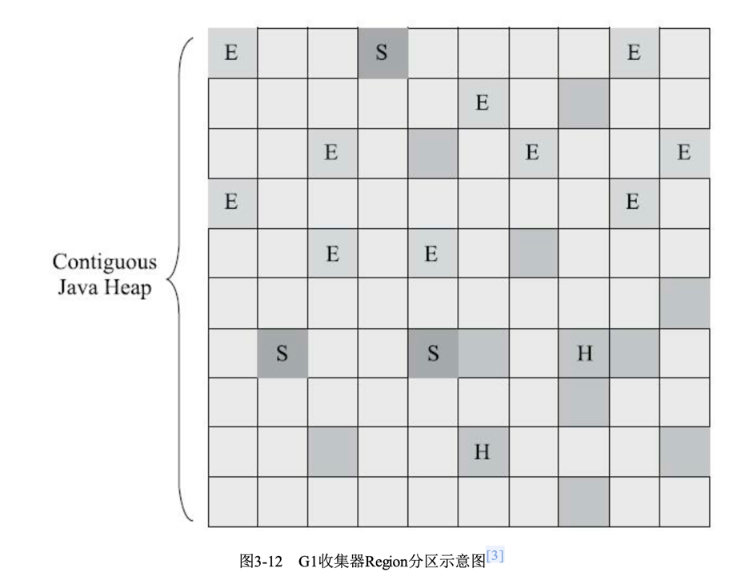
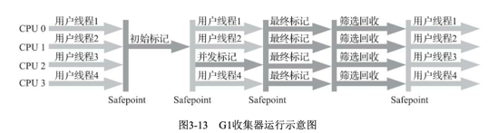

#概述
垃圾收集器需要做的三件事情：
什么内存需要回收？
什么时候回收？
如何回收？  
对于java来说，垃圾收集器是用来回收堆内存与方法区内存的。
#垃圾收集算法
##标记-清除算法
##标记-整理算法
##标记-复制算法
##分代收集算法 
##hotsopt垃圾收集算法细节
1. 根节点枚举 
   枚举gcroot，暂停用户线程，枚举gcroot；gcroot主要包括：虚拟机栈中引用的对象、方法区中类静态属性引用的对象、方法区中常量引用的对象、本地方法栈中JNI（即一般说的Native方法）引用的对象。
   可以通过oomap加速gcroot枚举。
2. 安全点  
    程序不实在任意位置都可进行安全回收，只有在安全点才可进行垃圾回收。
3. 安全区域
   解决阻塞线程无法进入主动跑到安全点进行回收的问题。
4. 记忆集与卡表 
   非收集区到收集区的指针集合，用于记录非收集区的对象引用了收集区的对象，缩小gc的扫描范围，不需要将整个老年代加入到gcroot扫瞄范围中。
5. 写屏障
   保障卡表变脏与跨代引用的同时问题。  
5. 并发标记
   为了减少停顿时间，gc选择并发标记，即在用户线程运行的同时，gc线程进行标记。但是会造成并发标记时，用户线程修改了引用关系，导致的标记不准确问题。
   三色标记：白色、灰色、黑色。
   本该存活的对象标记为死亡的情况：  
      
   当且仅当以下两个条件同时满足时，会产生“对象消失”的问 题，即原本应该是黑色的对象被误标为白色:   
   1. 赋值器插入了一条或多条从黑色对象到白色对象的新引用;   
   2. 赋值器删除了全部从灰色对象到该白色对象的直接或间接引用。  
   翻译一下就是：在增加由已经扫描过的对象之像未被扫描的对象的同时，删除由正在扫描的对象到未扫描的引用。   
   解决方案：
      增量更新要破坏的是第一个条件，当黑色对象插入新的指向白色对象的引用关系时，就将这个新
      插入的引用记录下来，等并发扫描结束之后，再将这些记录过的引用关系中的黑色对象为根，重新扫
      描一次。这可以简化理解为，黑色对象一旦新插入了指向白色对象的引用之后，它就变回灰色对象
      了。查增 
      原始快照要破坏的是第二个条件，当灰色对象要删除指向白色对象的引用关系时，就将这个要删
      除的引用记录下来，在并发扫描结束之后，再将这些记录过的引用关系中的灰色对象为根，重新扫描
      一次。这也可以简化理解为，无论引用关系删除与否，都会按照刚刚开始扫描那一刻的对象图快照来
      进行搜索。补漏
      
#垃圾收集器

##Serial收集器    

##ParNew收集器

##Parallel Scavenge收集器
Parallel Scavenge收集器也是一款新生代收集器，它同样是基于标记-复制算法实现的收集器，也是 能够并行收集的多线程收集器。
Parallel Scavenge收集器的特点是：吞吐量优先。

##Parallel Old收集器
Parallel Old是Parallel Scavenge收集器的老年代版本，支持多线程并发收集，基于标记-整理算法实 现。这个收集器是直到JDK 6时才开始提供的，在此之前，新生代的Parallel Scavenge收集器一直处于相 当尴尬的状态，原因是如果新生代选择了Parallel Scavenge收集器，老年代除了Serial Old(PS
M arkSweep)收集器以外别无选择，其他表现良好的老年代收集器，如CM S无法与它配合工作。

##CMS收集器
cms是关注最小用户线程停顿的收集器。
其中初始标记与重新标记需要停顿线程，其他阶段都可与用户线程并发执行。
cms的优缺点
优点：并发收集，低停顿
缺点：1. 浮动垃圾，并行标记期间产生的垃圾
     2. 并行标记期间用户线程需要分配内存。因为与用户线程并行，所以不能等堆内存全部满了才收集，需要预留出一部分内存供用户线程使用。
     3. 并行标记期间会降低应用程序吞吐。
     4. 内存碎片，也有一部分优化技术 相邻空闲链表合并，

##G1收集器
g1将整个堆划分为多个大小相等的独立区域，每个区域称为一个region，每个region都可以独立回收，也可以与其他region一起回收。建立了一个基于时间停顿模型的收集器。每个region都可以
扮演eden、survivor、old三种角色。Region中还有一类特殊的Humongous区域，专门用来存储大对象。G1认为只要大小超过了一个 Region容量一半的对象即可判定为大对象。
让G1收集器去跟踪各个Region里面的垃 圾堆积的“价值”大小，价值即回收所获得的空间大小以及回收所需时间的经验值，然后在后台维护一 个优先级列表，每次根据用户设定允许的收集停顿时间(使用参数-XX:M axGCPauseM illis指定，默 认值是200毫秒)，优先处理回收价值收益最大的那些Region，这也就是“Garbage First”名字的由来

   
g1 筛选回收(Live Data Counting and Evacuation):负责更新Region的统计数据，对各个Region的回 收价值和成本进行排序，根据用户所期望的停顿时间来制定回收计划，可以自由选择任意多个Region 构成回收集，然后把决定回收的那一部分Region的存活对象复制到空的Region中，再清理掉整个旧 Region的全部空间。这里的操作涉及存活对象的移动，是必须暂停用户线程，由多条收集器线程并行 完成的。   
g1 的优缺点
缺点：内存占用较大。
优点：解决了cms空间碎片的问题。G1从整体来看是基于“标记-整理”算法实现的收集器，但从局部(两个Region 之间)上看又是基于“标记-复制”算法实现，无论如何，这两种算法都意味着G1运作期间不会产生内存 空间碎片，垃圾收集完成之后能提供规整的可用内存。
一般小内存上用cms 大内存用g1 
##zgc收集器
##shenandoah收集器
