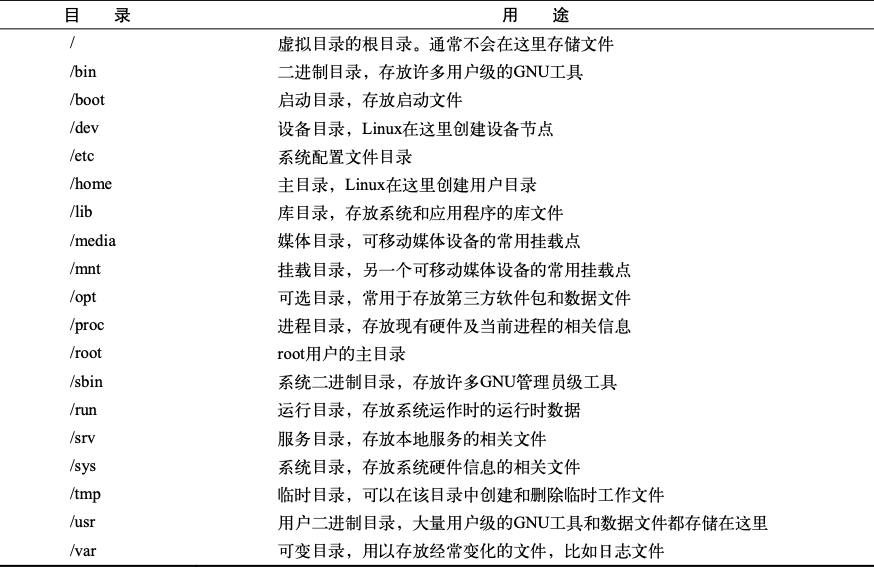

#文件管理
+ 常见Linux目录名称   
   
+ 创建文件
```bash
touch aaa
```
+ 复制文件
```bash
cp source destination
```
cp常用参数：  
-i选项，强制shell询问是否需要覆盖已有文件 
-R  递归复制
+ 链接文件  
  + 符号连接
    ```bash 
    ln -s data_file sl_data_file
    ls -l *data_file
    296890 -rw-rw-r-- 1 christine christine 1092 May 21 17:27 data_file
    296891 lrwxrwxrwx 1 christine christine 9 May 21 17:29 sl_data_file -> data_file 
    ```
  + 硬链接 
    ```bash 
    ln code_file hl_code_file
    ls -li *code_file
    296892 -rw-rw-r-- 2 christine christine 189 May 21 17:56 code_file
    296892 -rw-rw-r-- 2 christine christine 189 May 21 17:56 hl_code_file
    ```
#系统监测


