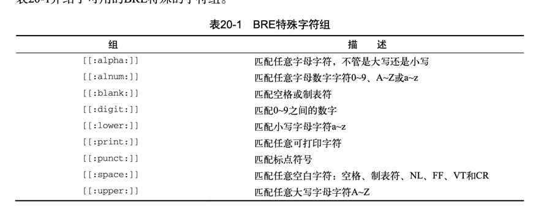

##正则表达式的规则 bre  
1. .  来匹配除换行符之外的任意单个字符   
2. [] 限定待匹配的字符   
3. ^ 排除字符 一般与[] 配置使用    
4.   
5. \* 出现0次或者多次     
##扩展分区表达式 ere
1. ? 匹配0 or 1次
2. + 匹配至少一次
3. {m}出现m次  {m,n} 出现m到n次
4. | 或者的意思
5. () 看做一个整体 例如 
```bash
echo "Sat" | gawk '/Sat(urday)?/{print $0}' 
Sat 
echo "Saturday" | gawk '/Sat(urday)?/{print $0}'
Saturday
```
正则表达式例子：   


    